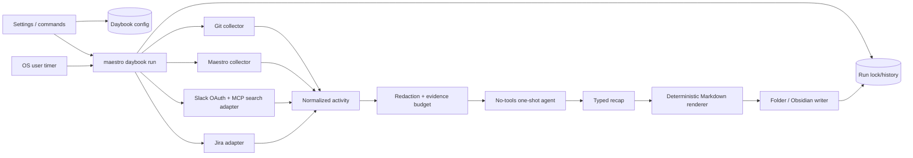

# Maestro Daybook — product, UX, and implementation plan

**Status:** Linux MVP implemented; integration and release validation pending (2026-09-02)  
**Prepared:** 2026-08-31  
**Scope of this document:** product definition, interaction design, technical architecture,
security model, rollout plan, and acceptance criteria. Implementation status is tracked in the
repository rather than duplicated here.

## 1. Recommendation

Name the feature **Daybook**.

“Day summarizer” describes an implementation. “Daybook” describes the thing the user owns: a
durable, dated record of work. It is short enough for navigation and command names, does not imply
that every entry is merely a generated paragraph, and supports clear interface language:

- Daybook settings
- Run Daybook now
- Open today’s entry
- Backfill a day
- Daybook was written without Slack

“Daily Coda” fits Maestro’s musical language, but it collides conceptually with the Coda product and
is less immediately understandable. “Workday Recap” is clear but generic and makes the resulting
archive sound disposable.

### Product statement

Daybook creates a private, source-linked Markdown record of a person’s work from their registered
Git projects, Maestro agent sessions, Slack activity, and Jira activity. A chosen Maestro agent
writes the entry. An OS-level schedule runs it even when Maestro’s window is closed. The result goes
to either a normal folder or a chosen Obsidian vault.

### Success criteria

A user should be able to answer “What did I actually do last Tuesday?” from one note, while still
being able to see which source supported each important claim.

The entry must be:

- **Honest about coverage.** A partial run says what was unavailable; it never calls itself a full
  account when Slack or Jira failed.
- **Local-first.** Collection, normalization, and writing happen locally. Only the bounded evidence
  packet is sent to the already-selected agent provider.
- **Idempotent.** Re-running a date updates one managed block instead of duplicating or overwriting
  the user’s notes.
- **Durable.** The scheduled path does not depend on the Tauri window being open.
- **Traceable.** Important bullets retain commit SHAs, Jira issue links, or Slack permalinks where
  available.
- **Official at integration boundaries.** Slack uses user-scoped OAuth with PKCE and Slack's
  supported Real-time Search surface. Slack Desktop cookies are not read or decrypted.

## 2. What “the day” includes

The product should define the promise precisely. “Everything” is not technically honest without a
boundary.

### Default activity scope

| Source  | Included by default                                                                                                                                                             | Optional                                                                 | Excluded                                                                  |
| ------- | ------------------------------------------------------------------------------------------------------------------------------------------------------------------------------- | ------------------------------------------------------------------------ | ------------------------------------------------------------------------- |
| Git     | User-authored commits across all refs in registered projects; commit subject/body, short SHA, branch/ref context, file/stat summary; current uncommitted file stats at run time | Patch excerpts                                                           | Full repository content and full diffs                                    |
| Maestro | Agent sessions with activity in the date window; session title, user request, final response, files changed, completion metadata                                                | Tool-result text                                                         | Thinking text, permission payloads, raw tool input, terminal scrollback   |
| Slack   | Messages and thread replies authored by the connected user in selected workspaces/channels                                                                                      | DMs, thread parent/context, reactions made, messages mentioning the user | Channels the user cannot access, messages merely read, files and canvases |
| Jira    | Worklogs authored by the connected user; comments and issue transitions authored by the user on candidate issues; current issue key/summary/status                              | Assigned issues updated by other people, issue description               | Unrelated project activity and any write operation                        |

Git identities are auto-detected from registered repositories and shown as an editable list of names
and email addresses. This prevents another author’s commits from silently entering the entry and
allows a user with work and personal addresses to include both.

Slack defaults to **messages I sent**. Private channels can be included, but DMs are a separate,
off-by-default switch because their privacy expectation is materially different. “Slack
interactions” does not mean ingesting every message in every channel the user can see.

Jira candidate discovery should start from worklogs and issues that match a configurable JQL scope.
The default scope is the connected user’s worklogs plus issues assigned to or reported by that user
and updated during the date window. Changelogs, comments, and worklogs are then filtered by the
connected user’s account id and timestamp. This is accurate about personal activity without
pretending Jira offers a single complete “my activity today” endpoint.

### Date semantics

There are two run modes:

1. **After the day ends (recommended):** run at 00:10 local time for the previous calendar day. This
   is the only default that can honestly cover a complete calendar day.
2. **At a chosen time:** run for the current calendar day up to the trigger time. The UI labels this
   “day so far.” A later manual run updates the same entry.

Every run persists its explicit UTC start/end instants plus the IANA time-zone name used to derive
them. Past dates are always full local calendar days. DST transitions therefore produce legitimate
23- or 25-hour windows instead of being forced into 24 hours.

## 3. Information architecture

Daybook should not add a permanent activity-rail icon. It is configured occasionally and consumed
mostly through its output file. Adding it to the rail would compete with daily IDE work for a
low-frequency control surface.

Use these entry points:

- **Settings → Daybook:** onboarding, integrations, schedule, destination, last-run status.
- **Command palette:** `Daybook: Run now`, `Daybook: Preview today’s inputs`, `Daybook: Open latest
entry`, `Daybook: Backfill a day`, and `Daybook: Open settings`.
- **Completion toast / system notification:** concise result with `Open entry` and, for partial
  runs, `Review issue`.
- **Markdown editor:** a normal Maestro Markdown tab for a file destination. An Obsidian destination
  additionally offers `Open in Obsidian`.

The existing settings shell in
[`SettingsModal.tsx`](../src/components/settings/SettingsModal.tsx) is the right home. Add a
`Daybook` section with a notebook/calendar icon after `Agents & CLI`. The setup flow uses the right
pane; it does not introduce a second modal shell.

## 4. Visual and interaction direction

Daybook is a work ledger inside an IDE. It should look like Maestro, not a separate lifestyle app.

### Visual tokens

Use the existing theme variables and type system from
[`themes.ts`](../src/design/themes.ts) and [`tokens.css`](../src/styles/tokens.css):

- Canvas: Maestro `--bg` (`#0d1016`)
- Raised row: `--bg-2` (`#12151c`)
- Selected/managed region: `--accent-soft` (`rgba(124,140,255,.14)`)
- Primary text: `--text` (`#e7ebf2`)
- Secondary text: `--text-dim` (`#aab4c6`)
- Accent/action: `--accent` (`#7c8cff`)
- UI text: Inter Variable; paths, times, commit SHAs, and counts: JetBrains Mono

No Daybook-specific hard-coded palette should bypass themes. Source dots use the existing semantic
tokens: Git `--purple`, Maestro `--green`, Slack `--yellow`, Jira `--blue`.

### Signature element: the day strip

Preview and run details contain one horizontal 24-hour strip. Small source-colored ticks show when
activity was found. Hover/focus reveals the time, source, and short label. It communicates gaps,
clusters, late-night work, and source coverage in less space than four mini charts.

This is the one distinctive element. The rest uses Maestro’s current cards, fields, status pills,
buttons, spacing, and motion. The strip animates only once from empty to populated after collection;
reduced-motion users see it immediately.

### Design self-review

A generic integrations dashboard with large service logos, marketing copy, and decorative metrics
would not fit Maestro. The revised direction keeps setup in the existing dense settings grammar,
uses the step numbers only because onboarding is a real sequence, and makes the visual signature
encode the date/source relationship. There is no new typography, permanent navigation, or ambient
animation to maintain.

## 5. First-run setup flow

Opening Settings → Daybook for the first time shows a short promise and a four-step setup. Settings
are not activated and no scheduler is registered until the review step succeeds.

```text
┌ Settings ─────────────┬────────────────────────────────────────────────────┐
│ Appearance            │ Daybook                                            │
│ Editor                │ A private record of what moved today, written      │
│ Terminal              │ where your notes live.                             │
│ Agents & CLI          │                                                    │
│ Daybook               │  1 Sources ─ 2 Writer ─ 3 Destination ─ 4 Schedule│
│ Language Intelligence│                                                    │
│ ...                   │ [ current step content ]                           │
│                       │                                                    │
│                       │                         Back   Continue              │
└───────────────────────┴────────────────────────────────────────────────────┘
```

### Step 1 — Sources

Each source row says exactly what will be read and exposes a test action.

```text
Sources

✓ Git & Maestro activity                         Ready
  3 registered projects · 5 supported agent CLIs
  [Choose projects]  [Data included…]

◌ Slack                              Not connected
  Connect a workspace with Slack. Daybook only collects messages you
  authored and never receives permission to write.
  [Connect Slack workspace]
  Include: [✓ Public] [ ] Private channels [ ] Direct messages
  Context: [✓ Thread root] [ ] Nearby replies

◌ Jira                              Environment found
  JIRA_BASE_URL and JIRA_EMAIL found. Import the API token into the OS
  keychain so scheduled runs can use it.
  [Import and test]  [Enter manually]
```

Connection success shows the identity and scope, not a vague “Connected”:

- `Slack · Acme Workspace · Saurabh · Public + private · DMs off`
- `Jira · saurabh@example.com · example.atlassian.net`

Slack authorization uses a user-only OAuth flow with PKCE. The consent screen groups public,
private, and direct-message coverage so optional scopes remain genuinely optional. A workspace
that requires administrator approval shows `Needs admin approval`, not a generic connection error.
Disconnect revokes the connection and removes its keychain entries. Because Slack grants are
additive, reducing scopes requires disconnecting and reconnecting; the UI must explain this before
requesting an expanded scope.

Jira fields accept `JIRA_EMAIL`, `JIRA_API_TOKEN`, and `JIRA_BASE_URL`. If those variables are
visible to the GUI process, `Import and test` copies the token to the OS keychain only after the user
clicks it; the value is never rendered back to React.

### Step 2 — Writer and privacy

Only installed and authenticated agents from Maestro’s central availability store are selectable.
The model and effort controls use the existing per-agent model capability API.

```text
Writer

Agent       [ Claude Code ▾ ]
Model       [ Sonnet (latest) ▾ ]
Effort      [ Medium ▾ ]

Data sent to this agent
✓ Commit metadata and file statistics
✓ Maestro session requests, final responses, and changed-file names
✓ My included Slack message text and selected thread context
✓ My Jira worklogs, comments, transitions, and issue metadata

[Preview today’s inputs]
```

The preview is source-grouped, count-first, and redacted. It shows the exact evidence text that
would leave the machine, not the Slack access/refresh token, Jira token, CLI auth, or local secret
paths. Users can exclude an item or source from that run without changing the saved defaults.

The agent runs with all tools disabled. Daybook never gives a summarization turn shell, file, Slack,
or Jira tools; the collector provides bounded data directly.

### Step 3 — Destination

Obsidian detection is presented first when a real vault is found. A normal folder remains a peer
choice, not a fallback hidden behind “Advanced.”

```text
Destination

(•) Obsidian vault
    Obsidian Vault                         Detected
    ~/Documents/Obsidian Vault
    Save as  [ Daybook/YYYY/YYYY-MM-DD.md             ]
    [Choose another vault]

( ) Markdown folder
    [Choose folder…]

[ ] Add to Obsidian’s existing daily note instead
    Heading [ Workday recap ]

Preview: …/Daybook/2026/2026-08-31.md
```

Creating separate `Daybook/YYYY/YYYY-MM-DD.md` notes is the recommended mode. Adding a managed
section to the existing Obsidian Daily Note is supported but explicitly secondary because it has
more conflict cases.

Direct file writing is preferable to using an Obsidian URI for creation: Obsidian stores notes as
plain Markdown and refreshes when another application changes a vault file. The URI is useful for
the post-write `Open in Obsidian` action. Obsidian’s Daily Notes plugin defaults to `YYYY-MM-DD` and
can use a configured folder/template, so the writer should read `.obsidian/daily-notes.json` when
the append mode is selected instead of assuming a path.

### Step 4 — Schedule and review

```text
Schedule

(•) After the day ends                       Recommended
    At 12:10 AM, write the previous calendar day.
( ) At [ 8:00 PM ] write the day so far.

Days        [ Every day ▾ ]
Time zone   [ Asia/Kolkata ▾ ]
[✓] Run after the next login/wake if the scheduled time was missed
[✓] Skip days with no activity

Today’s preview
  6 commits · 3 Maestro sessions · 14 Slack messages · 2 Jira issues
  → Obsidian Vault/Daybook/2026/2026-08-31.md

[Create Daybook]
```

`Create Daybook` performs these operations transactionally from the user’s perspective:

1. validate all enabled sources and destination;
2. save non-secret configuration and keychain references;
3. install the OS schedule;
4. read the schedule back and display its next trigger;
5. offer `Run a preview` or `Run and write today`.

If schedule installation fails, Daybook remains configured but disabled, with a specific fix. The
UI must not show “On” when only the database row was saved.

## 6. Returning-user settings

After onboarding, Settings → Daybook becomes a compact control panel rather than replaying the
wizard.

```text
Daybook                                         [ On ]
Next entry   Tomorrow, 12:10 AM · for today
Last entry   Today, 12:12 AM · Complete            [Open]
Destination Obsidian Vault/Daybook/2026/…          [Reveal]

[Run now] [Preview inputs] [Backfill…]

────────────────────────────────────────────────────────────
Sources       Git  Ready · Maestro  Ready
              Slack  2 workspaces · Jira  Connected       [Edit]
Writer        Claude Code · Sonnet · medium                [Edit]
Destination   Obsidian Vault · separate note               [Edit]
Schedule      Daily · 12:10 AM · Asia/Kolkata               [Edit]

Recent runs
Aug 30   Complete       6 commits · 14 messages · 2 issues
Aug 29   Partial        Slack session unavailable          [Retry]
Aug 28   No activity    No note created
```

Disabling the top switch removes/disables the OS timer but keeps configuration and run history.
`Delete Daybook configuration…` is a separate destructive action and does not delete generated
notes.

## 7. Run, preview, backfill, and failure flows

### Manual run

`Run now` defaults to today through the current instant and shows the destination before starting.
Collection progress is source-level (`Git`, `Maestro`, `Slack`, `Jira`, `Writing`, `Saving`), not a
fake percentage. A second run for the same date is rejected while the first holds the run lock.

### Preview inputs

Preview collects and normalizes data but does not call an agent or write a note. It shows:

- the day strip;
- total and included counts per source;
- truncation/chunking notices;
- source-specific failures;
- the exact outgoing evidence packet with secrets and machine-only paths redacted.

### Backfill

The date picker allows any past date. Backfill always uses a full calendar-day window and defaults
to the same destination naming rule. If a note already exists, the confirmation says `Update Aug
24 entry`, not `Create`.

### Partial success

Source collectors are independent. Git failing for one repository, an expired or unapproved Slack
connection, or a Jira 429 does not discard the other sources. The output includes a small coverage
footer and the run is marked `partial`:

> Coverage: Git (3/3 projects), Maestro, Jira. Slack was unavailable; retrying this date will update
> this entry.

The failure copy should always state the remedy:

- `Slack needs administrator approval in Acme Workspace. Ask an admin to approve Maestro, then
reconnect.`
- `Slack authorization expired before it could be refreshed. Reconnect Acme Workspace; the other
sources can still run.`
- `Jira rejected the saved email or token. Import JIRA_API_TOKEN again or replace the saved token.`
- `Codex is available in the app but not to scheduled jobs. Set an absolute binary path or choose a
different writer.`
- `The selected vault moved or is read-only. No note was changed.`

If the writer fails, no output file is modified. If saving fails, the generated structured result
can be retained in the run record only until one explicit retry, then discarded; raw source inputs
are never retained by default.

## 8. Output contract

The agent should return a typed recap, not final free-form Markdown. Maestro then renders Markdown
deterministically. This keeps headings, links, frontmatter, managed markers, and partial-coverage
language stable across providers.

Suggested internal result:

```json
{
  "headline": "Finished the session restore path and aligned release checks",
  "highlights": [{ "text": "Added durable transcript restoration", "refs": ["git:abc1234"] }],
  "completed": [],
  "inProgress": [],
  "collaboration": [],
  "jira": [],
  "tomorrow": [],
  "risks": []
}
```

Parse strictly, allow one repair retry, and fail without touching the destination if the result is
still invalid. Do not accept agent-supplied raw URLs; refs must resolve through the collector’s
allowlisted source map.

Suggested rendered note:

```markdown
---
date: 2026-08-31
maestro-daybook: true
---

# Sunday, 31 August 2026

<!-- maestro-daybook:start -->

## Day in brief

Finished the session restore path and aligned release checks.

## Completed

- Added durable transcript restoration (`abc1234`)
- Closed [MAE-42](https://example.atlassian.net/browse/MAE-42) after verification

## Collaboration

- Agreed on the release cutoff in [#engineering](https://example.slack.com/archives/...)

## In progress

- Slack OAuth integration and workspace approval

## Next

- Verify the scheduled runner under a locked desktop session

---

Coverage: Git (3/3 projects), Maestro, Slack, Jira · Generated by Claude Code at 00:12
<!-- maestro-daybook:end -->
```

For a separate Daybook note, Maestro owns only the region between the markers; text outside the
markers is preserved. For an existing Obsidian daily note, Maestro inserts/replaces the same region
under the configured heading. Malformed/duplicate markers cause a safe failure with no write.

Writes use a same-directory temporary file, `fsync` where supported, and atomic rename. The chosen
root is canonicalized, and the final path must remain beneath it after normalization. Symlink and
`..` escapes are rejected.

## 9. Technical architecture



### Module boundaries

Add a backend-only `daybook` domain that has no Tauri dependency in its core pipeline:

```text
src-tauri/src/daybook/
  config.rs          typed configuration and validation
  models.rs          ActivityItem, SourceResult, Recap, RunRecord
  runner.rs          locking and orchestration
  prompt.rs          evidence budgets, untrusted-content framing
  render.rs          deterministic Markdown
  secrets.rs         keychain references and redaction
  schedule/
    linux.rs         systemd user timer; cron fallback if required
    macos.rs         launchd LaunchAgent (later phase)
    windows.rs       Task Scheduler (later phase)
  collectors/
    git.rs
    maestro.rs
    slack/
      mod.rs
      auth_pkce.rs
      mcp_search.rs
      web_search.rs
      desktop_session.rs  # developer-only fallback
    jira.rs
  destinations/
    folder.rs
    obsidian.rs
```

The same `runner` is called by a Tauri command for preview/manual runs and by a headless executable
path for scheduled runs. A separate long-running daemon is unnecessary.

### Headless entry point

The current [`main.rs`](../src-tauri/src/main.rs) always starts Tauri. Add an early command dispatch:

```text
maestro daybook run --scheduled
maestro daybook run --date 2026-08-31
maestro daybook verify-schedule
```

The subcommand must return before Tauri/WebKit initialization. It opens the same app-data database,
uses the same logger, runs the async pipeline, and returns a meaningful process exit code.

Do not place secrets in scheduler unit files, command-line arguments, or environment files. The
runner reads keychain entries by stable identifiers.

### Reusing the agent layer

[`one_shot.rs`](../src-tauri/src/agents/one_shot.rs) is the correct foundation: it already disables
tools and normalizes prompt-to-text execution across all five agent kinds. It needs to be generalized
before Daybook uses it:

- replace `(kind, binary_path, prompt, cwd)` with a typed request carrying `model`, `effort`, `fast`,
  timeout, and provider environment;
- use the same resolved absolute binary and credential/environment path as interactive turns;
- pass Aider’s selected model and provider environment (the current one-shot path does not);
- pass the selected model to Claude, Codex, Cursor, and OpenCode using each confirmed CLI contract;
- support a longer bounded timeout and one structured-output repair attempt;
- capture usage/cost metadata where the provider exposes it;
- keep tools disabled for every provider.

The existing commit-message generator then migrates to this request type, which prevents Daybook
from creating an almost-identical second execution layer.

### Database shape

Keep secrets out of SQLite. Add typed tables rather than spreading a multi-part feature over opaque
keys in the current generic `settings` table.

```sql
CREATE TABLE daybook_config (
  id                  INTEGER PRIMARY KEY CHECK (id = 1),
  schema_version      INTEGER NOT NULL,
  enabled             INTEGER NOT NULL,
  timezone            TEXT NOT NULL,
  schedule_json       TEXT NOT NULL,
  agent_json          TEXT NOT NULL,
  sources_json        TEXT NOT NULL,
  destination_json    TEXT NOT NULL,
  updated_at          TEXT NOT NULL
);

CREATE TABLE daybook_slack_connections (
  workspace_id        TEXT PRIMARY KEY,
  enterprise_id       TEXT,
  user_id             TEXT NOT NULL,
  workspace_name      TEXT NOT NULL,
  display_name        TEXT NOT NULL,
  granted_scopes_json TEXT NOT NULL,
  credential_ref      TEXT NOT NULL UNIQUE,
  status              TEXT NOT NULL,
  connected_at        TEXT NOT NULL,
  last_validated_at   TEXT
);

CREATE TABLE daybook_runs (
  id                  TEXT PRIMARY KEY,
  entry_date          TEXT NOT NULL,
  window_start        TEXT NOT NULL,
  window_end          TEXT NOT NULL,
  trigger             TEXT NOT NULL,
  status              TEXT NOT NULL,
  started_at          TEXT NOT NULL,
  finished_at         TEXT,
  agent_json          TEXT NOT NULL,
  source_status_json  TEXT NOT NULL,
  item_counts_json    TEXT NOT NULL,
  output_path         TEXT,
  error_summary       TEXT
);

CREATE UNIQUE INDEX one_active_daybook_run
ON daybook_runs(entry_date)
WHERE status IN ('collecting', 'writing', 'saving');
```

The active-run guarantee should also use an OS file lock because SQLite’s partial unique index does
not protect two processes before both have fully initialized or after a crashed row is left active.
At startup, stale active rows are reconciled using the lock and marked `interrupted`.

Run history contains counts, statuses, output location, and redacted errors—not source bodies,
prompts, cookies, tokens, or full model output.

### Frontend/backend contract

Suggested Tauri commands:

- `get_daybook_overview`
- `detect_daybook_integrations`
- `test_daybook_source`
- `begin_daybook_slack_oauth`
- `complete_daybook_slack_oauth`
- `disconnect_daybook_slack_workspace`
- `preview_daybook_inputs`
- `save_daybook_config`
- `install_daybook_schedule`
- `remove_daybook_schedule`
- `run_daybook_now`
- `list_daybook_runs`
- `open_daybook_output`

Long work emits a `daybook://<run-id>` event with source-level states. The event schema uses concrete
stages and counts, not percentages.

## 10. Source implementation notes

### Git

For each unique registered project root:

1. resolve configured author identities;
2. query `git log --all` within the UTC instants for the local date;
3. include commit metadata and `--numstat`/`--shortstat`, bounded commit bodies, and refs;
4. deduplicate by `(canonical repository, commit hash)` so multiple worktrees do not duplicate work;
5. collect current worktree status/stat as “in progress,” deduplicated by worktree path.

The existing Git module and project database already supply most of the primitives, but the current
UI log command is pagination-oriented and active-worktree scoped. Daybook needs a purpose-built
read-only query across all refs and all registered projects.

### Maestro sessions

The current session discovery in
[`sessions.rs`](../src-tauri/src/agents/sessions.rs) already parses timestamps and worktree roots
from several CLI-native histories. The saved rendered transcript adds per-turn completion time in
[`agentSessionStore.ts`](../src/state/agentSessionStore.ts).

Add a backend activity projection instead of passing opaque transcript JSON to the model. Include
only turns whose timestamps overlap the date, with:

- session title and provider;
- bounded user request text;
- bounded final assistant response;
- changed-file names and baseline/HEAD movement;
- duration/token/cost metadata where available.

Exclude thinking, raw tool payloads, permission records, and terminal transcripts. A source setting
can reduce this to metadata-only for users who do not want prompts sent to another provider.

### Slack (OAuth/PKCE and official search)

Slack uses two independent seams so authentication and data retrieval can evolve without changing
normalization:

```text
SlackAuthProvider
  OAuthPkceUserAuth          production

SlackSearchProvider
  SlackRealTimeSearchAdapter production
```

The production connection is a public-client OAuth flow with user scopes only:

1. Rust generates an unpredictable OAuth `state`, PKCE verifier, and S256 challenge. The verifier
   remains backend-only and is stored under a short-lived keychain entry so callback activation can
   survive Maestro restarting.
2. Maestro opens Slack's user authorization endpoint with the registered
   `maestro://oauth/slack` callback.
3. The Tauri deep-link handler validates the callback state and rejects unsolicited, reused, or
   expired transactions.
4. Rust exchanges the temporary code and verifier without a client secret, stores rotating access
   and refresh tokens in the OS keychain, and immediately deletes the transaction entry.
5. Maestro validates the connection, records the workspace/user identity and granted scopes in
   SQLite, and never returns token material to React.
6. The headless runner refreshes expiring credentials through the same keychain-backed provider;
   Slack Desktop does not need to be installed or running.

Initial permissions are deliberately incremental:

- required: `search:read.public`;
- optional: `search:read.private`;
- optional and off by default: `search:read.im` and `search:read.mpim`;
- optional: `search:read.users` when display-name resolution is enabled;
- no chat, reaction, file-write, channel-write, or bot scopes.

Daybook queries each connected workspace through `assistant.search.context` for messages authored
by the connected user within the requested local date. The request also includes exact
`after`/`before` Unix bounds, timestamp sorting, and cursor pagination. DM/MPDM content types are
omitted unless separately enabled. Results are post-filtered against the same window, normalized,
and deduplicated by
`(workspace_id, channel_id, message_ts)`.

The optional context setting asks the same bounded search request for context messages; collection
still retains only records authored by the connected user, preventing unrelated channel history
from being swept into the run. The selected summarization agent does not receive Slack credentials
or Slack tools; the backend collector invokes Slack and passes only normalized evidence into the
no-tools writing turn.

`SlackRealTimeSearchAdapter` uses Slack's official search surface because it offers granular
public/private/DM scopes and bounded contextual results. It currently requires an internal or
directory-published Slack app. Development therefore begins with an internal app, while Marketplace
submission is an explicit release dependency. Maestro must not direct commercial users to
construct templated internal apps as a substitute for distribution approval. The installed Slack
Desktop client and its cookie database are detected only to explain migration from the earlier
prototype; Maestro does not read or decrypt them.

The adapter uses bounded pages and response sizes, retries one short `429 Retry-After`, and
distinguishes approval, missing-scope, expired-token, revoked-token, and rate-limit failures from
generic errors. Longer rate limits make the Slack source partial rather than blocking the rest of
the scheduled run.

### Jira

Support Jira Cloud REST v3 first. Validate credentials with `/rest/api/3/myself` using basic auth
formed from Atlassian account email plus API token. Store:

- base URL and email: non-secret configuration;
- API token: OS keychain under a Daybook-specific service/account;
- returned account id/display name: non-secret connection metadata.

For a date:

1. search candidate issues with bounded JQL;
2. fetch required fields plus paginated comments, changelog, and worklogs;
3. filter activity by connected account id and UTC window;
4. convert Atlassian Document Format to safe plain text/limited Markdown;
5. create Jira refs using only validated links beneath the configured base URL.

The `/worklog/updated` plus bulk worklog endpoint can be used as an optimization/cursor source, but
not as the only date query: Atlassian documents pagination, visibility filtering, and a one-minute
exclusion at the head of that feed. Use overlap and deduplication if it is introduced.

Detect Jira Data Center/server responses and report `This release supports Jira Cloud; Data Center
needs the v2 adapter` rather than failing as an unexplained 404. A v2 adapter can follow once the
user confirms it is needed.

### Obsidian / folder writer

Vault detection order:

1. Obsidian’s platform-specific global configuration;
2. known/selected recent vaults from that configuration;
3. bounded local discovery of folders containing `.obsidian` only when the user asks to scan;
4. manual folder selection.

A `.obsidian` directory is the validation marker; the user still confirms the vault. The local host
already provides a real integration target: `/usr/bin/obsidian` exists, a vault exists at
`~/Documents/Obsidian Vault`, and its Daily Notes core plugin is enabled with default settings.
Testing should use a temporary copy or dedicated test subfolder until the user explicitly authorizes
writing into the live vault.

## 11. Scheduler design

“Cron” should be the product concept, not the Linux-only implementation contract. Use the native
per-user scheduler:

- **Linux MVP:** systemd user service + timer; fall back to user crontab only where a user systemd
  manager genuinely does not exist.
- **macOS:** `launchd` LaunchAgent.
- **Windows:** per-user Task Scheduler task.

Linux unit behavior:

- `Type=oneshot`
- `OnCalendar` in the configured local time zone
- `Persistent=true` for missed wake/login runs
- `AccuracySec=1m`
- absolute executable path and `daybook run --scheduled`
- no secrets or user content in the unit
- stable working directory under Maestro app data
- stdout/stderr routed to Maestro’s normal redacted logs

After writing units, run daemon reload/enable and query the next trigger. The database’s `enabled`
bit follows verified scheduler state, not the other way around.

Important packaging case: an AppImage process may report an executable path under a temporary
`.mount_*` directory. Use the stable original `APPIMAGE` path when present; never register the
temporary mount path. Deb/rpm installs can use their stable installed binary.

Scheduled processes often have a smaller `PATH`, no shell profile, and potentially no unlocked
desktop keyring. Setup must verify the exact headless command in a scheduler-like environment before
enabling. Persist/resolve absolute agent CLI paths rather than hoping the timer inherits the GUI’s
environment.

`Persistent=true` should not silently backfill weeks of missed notes. The runner catches up one
scheduled date only when it is at most 36 hours old; older dates appear as `Missed` with a `Backfill`
action.

The Linux systemd service/timer generator and headless `--daybook-run` route are implemented. The
current local sandbox cannot connect to the user systemd bus, so installation, next-trigger
inspection, and a run with the UI closed remain real-host integration tests.

## 12. Privacy and security model

Daybook combines sensitive systems, so the privacy design is part of the feature rather than a
settings footnote.

### Rules

- Jira tokens use the existing OS-keychain strategy already established for Aider credentials.
- Slack uses user-only OAuth with PKCE. Access/refresh tokens and in-flight PKCE verifiers remain in
  the OS keychain; SQLite stores only identities, granted scopes, status, and credential references.
- OAuth `state` is unpredictable, single-use, expiry-bound, and validated before any code exchange.
- Disconnect revokes/removes the Slack credential and deletes its connection metadata.
- Raw source inputs are not persisted by default.
- Secrets, auth headers, cookies, and environment values are redacted at the logging boundary.
- The UI displays whether a secret exists, never its value.
- Every external request has HTTPS enforcement, a timeout, bounded response size, and an allowlisted
  host derived from the selected integration.
- Jira base URLs reject embedded credentials and unsafe schemes.
- Slack/Jira text is untrusted data. It is delimited in the prompt, cannot enable tools, and cannot
  supply renderer URLs or headings directly.
- Agent prompt budgets are explicit per source. No source can starve all others.
- The preview says which data leaves the machine and which provider receives it.
- Private Slack DMs remain opt-in.
- Destination writes are contained beneath the user-selected canonical root.

### Evidence budgeting

Never silently truncate an “entire day.” The evidence packet records collected, included, and
omitted counts per source. Start with a bounded final request and deterministic compaction. When a
source exceeds its budget, chunk it into source summaries and then perform one final synthesis. The
note’s coverage metadata reports that compaction occurred.

Suggested initial budgets are 16k characters Git, 12k Maestro, 20k Slack, and 16k Jira, adjusted to
the chosen model’s known context window. These are implementation starting points, not UI promises.

## 13. Delivery plan

### Phase 0 — feasibility and external-access spikes (4–6 engineering days)

1. Register an internal Slack app, enable user-only PKCE, and prove custom-URI authorization,
   restart-safe callback completion, token rotation, scheduled refresh, revoke, and reconnect.
2. Validate self-authored, date-bounded collection through Slack's MCP/search surface, including
   private-channel and DM scope separation; begin Marketplace submission and record it as an
   external release dependency.
3. Run each supported one-shot agent from a minimal systemd-like environment; verify auth, absolute
   binary resolution, model selection, and structured JSON output.
4. Resolve a stable AppImage/deb executable path and validate a user timer on the real host.
5. Detect the local Obsidian vault and Daily Notes configuration; atomic-write only to a temporary
   test vault.

**Gate:** production Slack ships only when the OAuth/PKCE flow is reliable and the Maestro Slack app
is internal-approved or directory-published. Marketplace review time is not hidden inside the
engineering estimate. If access is delayed, ship the remaining Daybook sources with Slack visibly
unavailable; do not promote desktop-cookie auth into the release path.

### Phase 1 — core pipeline and manual Daybook (6–8 days)

- typed config/run schema and migrations;
- date/time-zone windowing and run lock;
- normalized activity model;
- Git and Maestro collectors;
- generalized one-shot agent request and structured recap;
- deterministic renderer and safe folder writer;
- preview, run-now, output open, and run-history backend APIs;
- unit/fixture coverage.

### Phase 2 — Jira, Slack, and Obsidian integrations (8–12 days)

- Jira connection/import, keychain storage, JQL/activity collector, ADF conversion;
- Slack OAuth/PKCE connection lifecycle, keychain rotation, multi-workspace metadata, MCP search,
  bounded context, and self-activity collector;
- source-specific privacy controls and partial failure reporting;
- Obsidian vault detection, separate-note writer, Daily Note managed block;
- live integration tests without checking credentials or user data into fixtures.

### Phase 3 — complete UI/UX (5–7 days)

- onboarding and returning settings pane;
- source tests, writer/model controls, destination picker, schedule review;
- day strip and input preview;
- command-palette entries, progress events, toasts, and empty/error states;
- keyboard, focus, reduced-motion, zoom, and theme verification.

### Phase 4 — durable scheduling and hardening (5–7 days)

- headless subcommand and Linux systemd user units;
- AppImage/package path handling;
- missed-run/catch-up semantics;
- crash recovery, lock reconciliation, retry and idempotency tests;
- security review, large-day budgets, 429/backoff, offline behavior;
- real-host end-to-end run with Maestro UI closed.

Expected Linux-first total: **28–40 engineering days**, plus Slack Marketplace review lead time.
The Slack implementation is now a supported OAuth/search integration rather than an experimental
cookie-decryption project; the remaining uncertainty is distribution approval and cross-process
scheduling/auth validation. macOS launchd and Windows Task Scheduler should be scoped as a
follow-on once the Linux runner contract is stable.

## 14. Test strategy

### Unit and fixture tests

- local-date windows across UTC offsets and DST transitions;
- Git identity filtering, all-ref collection, repository/worktree deduplication;
- each CLI-native Maestro session parser with per-turn timestamps;
- Slack PKCE challenge/state validation, callback replay rejection, scope mapping, keychain
  references, token refresh/revoke, pagination, retry-after, deduplication, and malformed content;
- Jira pagination, retry-after, deduplication, auth expiry, and malformed content;
- ADF/plain-text conversion and prompt-injection-shaped source text;
- evidence budgets and collected/included/omitted counts;
- strict recap parsing and repair retry;
- managed-marker replacement, malformed markers, path traversal, symlink escape, atomic failure;
- no-activity and partial-run rendering;
- stale lock/run recovery.

### Integration tests

- mock Jira HTTP, Slack OAuth, and Slack MCP JSON-RPC servers with recorded, scrubbed response
  shapes;
- real Jira test using the supplied environment variables;
- live Slack tests use an internal test app and assert only scopes, counts, identities, and coverage;
  they never snapshot message text or auth values;
- desktop-session tests, if the developer adapter is retained, are opt-in and cannot satisfy release
  acceptance;
- temporary Obsidian vault with default and custom Daily Notes folder/format/template;
- all five ready agents under a minimal environment;
- systemd timer fires while the Maestro window is closed and after a missed trigger;
- AppImage and installed-package executable paths.

### UX acceptance

- setup can be completed with keyboard only;
- every connection test identifies what account was tested;
- every secret field is one-way and never prefilled from the backend;
- preview reveals exactly what will be sent;
- rerunning one date never duplicates a managed section;
- a source outage creates a useful partial note and a retry path;
- `Open entry` works in Maestro and `Open in Obsidian` targets the right vault/note;
- 80–200% Maestro zoom and all four themes remain legible.

## 15. Release acceptance criteria

Daybook is ready for a Linux experimental release when all of these are true:

1. A real scheduled run completes with the Maestro window closed.
2. Git commits from multiple registered projects and worktrees are deduplicated and identity-filtered.
3. Maestro activity is date-filtered without including thinking/tool payloads.
4. Slack connects through user-only OAuth/PKCE, reads only configured self-authored activity through
   the approved MCP/search adapter, and keeps auth material out of SQLite, React, prompts, logs, and
   test artifacts.
5. Jira imports the supplied environment credentials into the keychain after consent and collects
   the connected user’s bounded activity read-only.
6. The detected local Obsidian vault can receive a note and reflect an external change; live-vault
   testing happens only after explicit authorization.
7. A rerun atomically updates one managed block and preserves user-authored text.
8. Partial source failures are visible in both run history and output coverage.
9. The chosen agent/model runs with tools disabled from the headless environment.
10. Secrets and raw source bodies are absent from persisted run history and application logs.
11. Offline, locked-keyring, expired/rotated/revoked Slack tokens, rejected OAuth state, admin
    approval, rate-limit, moved-vault, sleeping-machine, and crashed-run cases have tested recovery
    behavior.

## 16. Open product decisions

These defaults are reflected in the Linux MVP and remain useful product decisions to revisit before
release:

1. **Jira target:** Jira Cloud only for the first release, or must the supplied base URL also support
   Data Center immediately? Recommendation: Cloud v3 first, explicit detection/error for Data Center.
2. **Slack DMs:** recommendation is off by default with a separate consent switch.
3. **Obsidian mode:** recommendation is a separate `Daybook/` archive by default; Daily Note append
   is optional.
4. **Schedule:** recommendation is 00:10 for the previous calendar day; a chosen earlier time is
   labeled “day so far.”
5. **Project scope:** recommendation is all registered projects by default with per-project toggles.
6. **Maestro prompt content:** recommendation is requests + final responses + changed files by
   default, with a metadata-only option.
7. **Raw retention:** recommendation is none. Debug bundles should contain schemas/counts/redacted
   errors only.

## 17. Local feasibility findings

Inspection and implementation through 2026-09-02 found:

- Maestro is a Tauri/Rust + React application with SQLite, `reqwest`, `keyring`, typed Tauri
  commands, centralized agent availability, and a generic no-tools one-shot path. These are strong
  foundations; no second runtime or embedded Node process is needed.
- `/usr/bin/slack` is installed and its local Chromium cookie store contains encrypted values. This
  remains useful only for detecting that the desktop client exists; the primary integration no
  longer depends on Slack Desktop, its cookie format, or Electron safe-storage behavior.
- `/usr/bin/obsidian` is installed. `~/Documents/Obsidian Vault/.obsidian` exists, and the Daily
  Notes core plugin is enabled. No custom `daily-notes.json` was present, so Obsidian’s default
  `YYYY-MM-DD` behavior applies on this vault.
- Maestro now generates a per-user systemd service/timer using the stable executable or AppImage
  path and runs Daybook headlessly. The current sandbox cannot connect to the user bus, so timer
  registration must be verified outside this sandbox on the real desktop session.
- A GUI-launched application cannot safely assume it inherited the user’s shell environment, and a
  scheduled process cannot assume it inherited the GUI’s environment. Jira environment variables
  therefore use an explicit import-to-keychain flow. Agent binary paths still need real-host
  headless verification.

## 18. Primary references

- [Slack authentication overview](https://docs.slack.dev/authentication/)
- [Slack token types and user-token visibility](https://docs.slack.dev/authentication/tokens/)
- [Slack PKCE for desktop/public clients](https://docs.slack.dev/authentication/using-pkce/)
- [Slack user-only OAuth token exchange](https://docs.slack.dev/reference/methods/oauth.v2.user.access/)
- [Slack MCP server, scopes, and distribution requirements](https://docs.slack.dev/ai/slack-mcp-server/)
- [Slack Real-time Search API](https://docs.slack.dev/reference/methods/assistant.search.context/)
- [Slack legacy `search.messages` fallback](https://docs.slack.dev/reference/methods/search.messages/)
- [Slack non-Marketplace distribution and rate-limit policy](https://docs.slack.dev/changelog/2025/05/29/rate-limit-changes-for-non-marketplace-apps/)
- [Jira Cloud REST API v3](https://developer.atlassian.com/cloud/jira/platform/rest/v3/intro)
- [Jira API-token basic authentication](https://developer.atlassian.com/cloud/jira/platform/basic-auth-for-rest-apis/)
- [Jira worklog endpoints](https://developer.atlassian.com/cloud/jira/platform/rest/v3/api-group-issue-worklogs/)
- [How Obsidian stores Markdown and refreshes external changes](https://help.obsidian.md/Files%2Band%2Bfolders/How%2BObsidian%2Bstores%2Bdata)
- [Obsidian Daily Notes behavior](https://help.obsidian.md/Plugins/Daily%2Bnotes)
- [Obsidian URI actions](https://help.obsidian.md/Extending%2BObsidian/Obsidian%2BURI)
